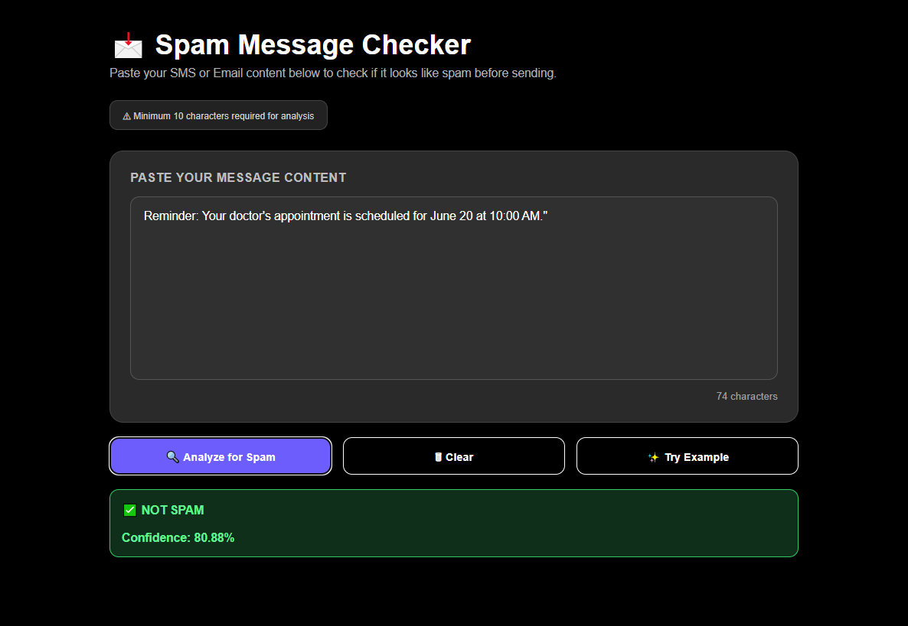
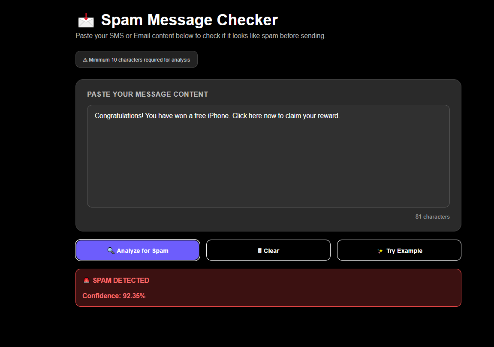

# 📩 Spam Message Classifier

A Machine Learning-based web application that analyzes text messages and classifies them as **Spam** or **Not Spam**. The project uses Natural Language Processing (NLP) techniques and a trained classification model to detect unwanted or potentially harmful messages with high accuracy.

## 🚀 Live Demo

https://mrhamzahafeez.github.io/Spam_Classifier/

## ✨ Features

* Detects Spam and Not Spam messages instantly
* User-friendly and responsive web interface
* NLP-based text preprocessing and feature extraction
* Machine Learning-powered prediction system
* Real-time confidence score for predictions

## 🛠️ Technologies Used

* Python
* Scikit-Learn
* FastAPI
* HTML, CSS, JavaScript
* NLP (Natural Language Processing)
* TF-IDF Vectorization

## 📊 Project Workflow

1. User enters a message.
2. Text is cleaned and preprocessed.
3. TF-IDF converts text into numerical features.
4. The trained Machine Learning model predicts whether the message is Spam or Not Spam.
5. The result and confidence score are displayed to the user.

## 📸 Sample Outputs

### ✅ Not Spam

### 🚨 Spam

## 🎯 Purpose

This project demonstrates the practical application of Machine Learning and NLP in solving real-world problems such as spam detection. It also showcases full-stack integration using FastAPI for the backend and a modern web interface for the frontend.
